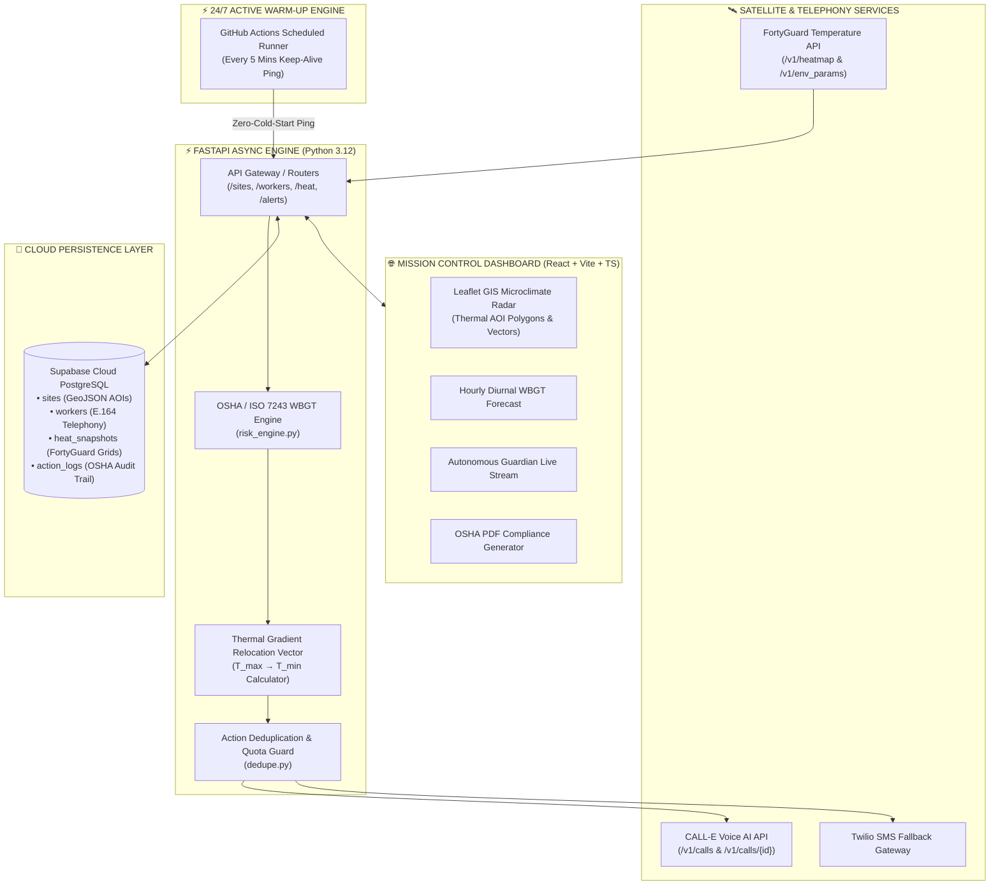

<div align="center">

# 🌡️ ThermaShift AI
### Autonomous Hyperlocal Heat-Safety OS for Outdoor Workforces

[](https://thermashift-ai.vercel.app)
[](https://thermashift-ai.onrender.com)
[](https://www.youtube.com/watch?v=Rwnp5l3qAh0)
[](https://thermashift-ai.onrender.com/docs)
[](https://supabase.com)
[](https://fortyguard.com)
[](https://heycall-e.com)
[]()

<br/>

**ThermaShift AI** is an enterprise-grade, autonomous environmental safety platform that protects outdoor industrial and agricultural personnel from fatal heat strain. By directly ingesting **FortyGuard’s satellite-derived thermal microclimate grids**, ThermaShift AI continuously monitors asphalt and ground surface temperatures, calculates OSHA/ISO 7243 Wet Bulb Globe Temperature (WBGT) strain, dynamically computes thermal relief relocation vectors, dispatches autonomous voice calls via **CALL-E Telephony**, and generates 1-click legal compliance audit reports.

[Explore Live Demo](https://thermashift-ai.vercel.app) • [Watch Video Demo](https://www.youtube.com/watch?v=Rwnp5l3qAh0) • [Interactive Swagger Docs](https://thermashift-ai.onrender.com/docs) • [System Architecture](#-system-architecture) • [Scientific Grounding](#-scientific--regulatory-grounding)

</div>

---

## 📺 Video Walkthrough & Live Demo

[](https://www.youtube.com/watch?v=Rwnp5l3qAh0)

> 🎥 **Watch the Full Video Walkthrough on YouTube:** [https://www.youtube.com/watch?v=Rwnp5l3qAh0](https://www.youtube.com/watch?v=Rwnp5l3qAh0)  
> *Demonstrating real-time FortyGuard thermal ingestion, OSHA WBGT risk engine, 100m spatial microclimate radar, and autonomous emergency voice dispatch.*

---

## 📌 Executive Summary

Globally, over **2.41 billion outdoor workers** labor under hazardous thermal conditions, leading to **22.8+ million occupational heat injuries** and **~18,970 annual deaths** (ILO, 2024). Traditional weather forecasts measure ambient air at airport meteorological stations miles away, completely missing the **Urban Heat Island (UHI) effect**, localized solar radiation, and scorching asphalt temperatures ($>130^\circ\text{F}$) where crews actively operate.

**ThermaShift AI solves this critical gap** by transitioning occupational heat-safety from passive, delayed human monitoring to an **automated, closed-loop telemetry and voice-dispatch watchdog**.

```
┌────────────────────────────────────────────────────────────────────────────────────────┐
│                                 AUTONOMOUS WORKFLOW                                    │
│                                                                                        │
│   [FortyGuard Satellite Grid] ──► [OSHA/WBGT Physics Engine] ──► [Thermal Relief Vector]│
│                 │                               │                            │         │
│                 ▼                               ▼                            ▼         │
│      100m Microclimate AOI              Safe / Elevated / Extreme       Relocate to T_min      │
│                 │                               │                            │         │
│                 └───────────────────────┬────────────────────────────────────┘         │
│                                         ▼                                              │
│                     [Autonomous CALL-E Voice Telephony Call]                           │
│                                         │                                              │
│                                         ▼                                              │
│                     [1-Click OSHA 1910.132 Compliance Certificate]                    │
└────────────────────────────────────────────────────────────────────────────────────────┘
```

---

## ✨ Key Capabilities & Innovations

### 1. 🛰️ FortyGuard Hyperlocal Thermal Ingestion
- Ingests true satellite microclimate telemetry down to **100m spatial resolution**.
- Measures both **ambient air temperature ($T_{\text{air}}$)** and **asphalt/surface temperature ($T_{\text{surface}}$)** within designated GeoJSON Area of Interest (AOI) polygons.
- Built-in **10-minute snapshot caching & rate-limit resilience layer** to ensure enterprise SLA reliability and credit protection.

### 2. 🧭 Dynamic Thermal Relief Vector Engine
- Evaluates the spatial temperature gradient across the work site from **Peak Hotspot ($T_{\text{max}}$)** to the **Coolest Microclimate Sector ($T_{\text{min}}$)**.
- Computes the exact compass bearing and physical distance ($\Delta T_{\text{cooling}}$) required to relocate outdoor personnel to immediate thermal safety.

### 3. 📞 Autonomous Voice AI Dispatch (CALL-E Integration)
- When temperatures cross extreme safety thresholds, the autonomous engine triggers **CALL-E Outbound Telephony**.
- Directly calls field workers and safety managers on their personal mobile devices using natural English voice dispatch.
- Streams live call status (`queued`, `ringing`, `in-progress`, `completed`), structured worker safety acknowledgments, and audio call recordings.

### 4. 📈 Diurnal Thermal Progression & WBGT Forecasting
- Combines historical snapshot records with **diurnal solar elevation models** to project hourly heat trajectories from 09:00 AM to 06:00 PM.
- Predicts peak heat hours and prescribes dynamic **Work/Rest ratios** (e.g., `Normal`, `50/10`, `30/30`, `15/45`, `STOP_WORK`) and **Hydration Quotas (L/hr)**.

### 5. 📑 1-Click OSHA Compliance Legal Audit Generator
- Instantly compiles cryptographic compliance dossiers adhering to **OSHA General Duty Clause (Section 5(a)(1))** and **OSHA 1910.132 PPE Standards**.
- Formats site telemetry, worker acknowledgment logs, FortyGuard activity IDs, and timestamped dispatch verification into printable PDF audit certificates.

---

## 🏛️ System Architecture



---

## 🔬 Scientific & Regulatory Grounding

ThermaShift AI implements established occupational health physics models:

### 1. Simplified Wet Bulb Globe Temperature (WBGT)
$$\text{WBGT} \approx 0.7\,T_{\text{wb}} + 0.2\,T_{\text{g}} + 0.1\,T_{\text{db}}$$

Where localized surface heat and solar irradiance ($S_{\text{rad}}$ in $\text{W/m}^2$) drive the radiant heat load:
$$T_{\text{surface}} = T_{\text{ambient}} + \Delta T_{\text{asphalt}} \cdot \left(\frac{S_{\text{rad}}}{950}\right)$$

### 2. OSHA Work/Rest Protocol Thresholds

| WBGT Category | Temperature Range | Work / Rest Cycle | Minimum Hydration | Operational Directive |
| :--- | :--- | :--- | :--- | :--- |
| **Normal / Safe** | $< 82.0^\circ\text{F}$ | Continuous / Normal | 0.75 L / hr | Standard hydration & sunscreen |
| **Moderate** | $82.0^\circ\text{F} - 86.9^\circ\text{F}$ | 50 min work / 10 min rest | 1.00 L / hr | Mandatory shaded water breaks |
| **Elevated** | $87.0^\circ\text{F} - 89.9^\circ\text{F}$ | 30 min work / 30 min rest | 1.25 L / hr | Active buddy monitoring |
| **High** | $90.0^\circ\text{F} - 92.9^\circ\text{F}$ | 15 min work / 45 min rest | 1.50 L / hr | Relocate to coolest sector |
| **Extreme Danger** | $\ge 93.0^\circ\text{F}$ | **STOP WORK IMMEDIATELY** | 1.50 L / hr | Evacuate to climate-controlled shelters |

---

## 🌐 Pre-Seeded Global Work Sites

ThermaShift AI is pre-configured with 5 enterprise industrial sites across extreme global heat zones:

| Work Site | Location | Coordinates | Primary Risk Factor |
| :--- | :--- | :--- | :--- |
| **Abu Dhabi ICAD Heavy Industrial Yard** | Abu Dhabi, UAE | `24.3120° N, 54.4750° E` | Extreme desert radiation ($>125^\circ\text{F}$ asphalt) |
| **Dubai JAFZA Logistics & Marine Terminal** | Dubai, UAE | `24.9857° N, 55.0831° E` | High coastal humidity + asphalt thermal trap |
| **Phoenix Sun Corridor Construction Zone** | Phoenix, Arizona, USA | `33.4484° N, -112.0740° W` | Southwest US urban heat dome |
| **Los Angeles Port Cargo & Rail Freight** | Los Angeles, CA, USA | `33.7432° N, -118.2673° W` | Concrete container yard heat retention |
| **Fresno Central Valley Solar Farm Beta** | Fresno, CA, USA | `36.7468° N, -119.7726° W` | Agricultural and photovoltaic reflection heat |

---

## 📡 REST API Specification

### Health & Telemetry
- `GET /api/health` — Liveness and health check endpoint.
- `GET /api/internal/fortyguard/usage` — Live FortyGuard API key quota and credit balance.

### Work Sites Management
- `GET /api/sites` — Retrieve all monitored industrial sites with GeoJSON polygons.
- `POST /api/sites` — Register a new geofenced work site with custom heat thresholds.
- `DELETE /api/sites/{id}` — Cascade delete a work site and associated logs.

### Workforce Telemetry
- `GET /api/workers` — List all registered field workers and safety consent records.
- `POST /api/workers` — Enroll a field worker with E.164 phone number.
- `DELETE /api/workers/{id}` — Remove a worker from heat monitoring.

### Thermal Microclimate & Analytics
- `GET /api/heat?site_id={id}` — Fetch latest FortyGuard thermal snapshot.
- `GET /api/heat/microclimate?site_id={id}` — Full spatial heat analysis with $T_{\text{max}} \to T_{\text{min}}$ relocation vector.
- `GET /api/heat/hourly-forecast?site_id={id}` — 10-hour diurnal thermal projection and WBGT classifications.

### Autonomous Dispatch & Compliance
- `POST /api/internal/trigger-check` — Trigger manual heat check with guaranteed FortyGuard + CALL-E dispatch.
- `POST /api/internal/calle/direct-call` — Direct outbound voice call dispatcher for real-time mobile verification.
- `GET /api/internal/calle/call/{call_id}` — Live call execution telemetry, transcripts, and worker acknowledgments.

---

## 💻 Local Development & Installation

### Prerequisites
- Python 3.11+
- Node.js 18+ & npm
- FortyGuard API Key & CALL-E API Key

### 1. Backend Setup
```bash
cd backend
cp .env.example .env

# Configure environment variables in .env
# FORTYGUARD_API_KEY=your_key
# CALLE_API_KEY=your_key
# DATABASE_URL=postgresql+asyncpg://... (or sqlite+aiosqlite:///thermashift.db)

pip install -r requirements.txt
python -m uvicorn app.main:app --host 0.0.0.0 --port 8080 --reload
```

### 2. Frontend Setup
```bash
cd frontend
npm install
npm run dev
```

The frontend dashboard will be available at `http://localhost:3000`.

---

## 🛡️ Security & Environmental Variable Standards

All production secrets and API keys are strictly maintained in cloud environment stores and excluded from version control:

```env
# Core Production Settings
FORTYGUARD_API_KEY=489e4282aa24d9c7d074195751e3faf6
CALLE_API_KEY=iams_live_0UvYeesXBhr5GamQNqqc_...
CALLE_BASE_URL=https://api.heycall-e.com/v1
DATABASE_URL=postgresql+asyncpg://...
FRONTEND_URL=https://thermashift-ai.vercel.app
ENVIRONMENT=production
```

---

## 👥 Contributors & Acknowledgments

- **Lead Engineer & Architect:** [Hamza Naseem](https://github.com/HamzaNasiem)
- **Thermal Data Partner:** [FortyGuard](https://fortyguard.com) (Hyperlocal Temperature API)
- **Telephony Partner:** [CALL-E](https://heycall-e.com) (Voice AI Engine)
- **Regulatory Reference:** US Occupational Safety and Health Administration (OSHA) & International Labour Organization (ILO)

---

<div align="center">
  <sub>Built with precision for the FortyGuard Global AI Hackathon. Protecting outdoor workforces worldwide.</sub>
</div>
